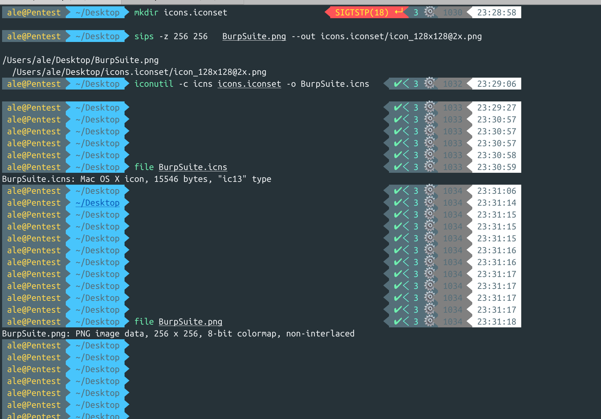
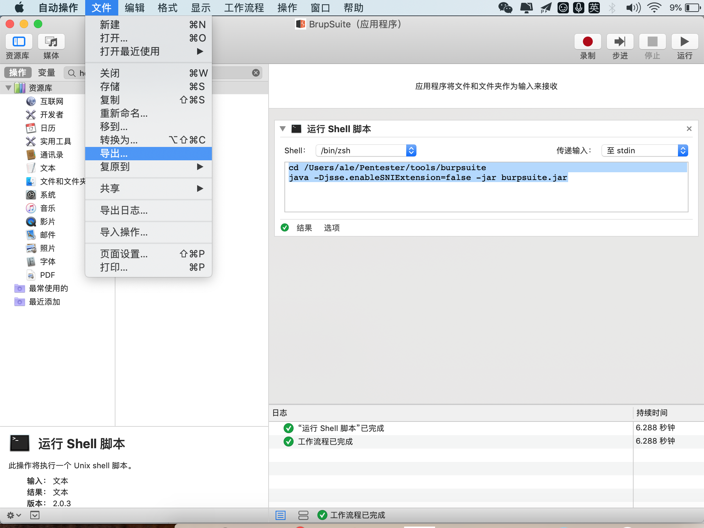
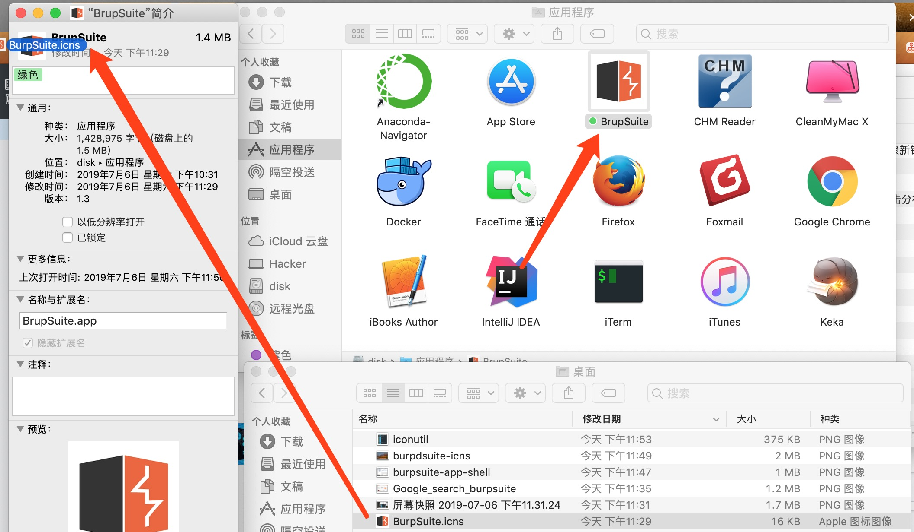
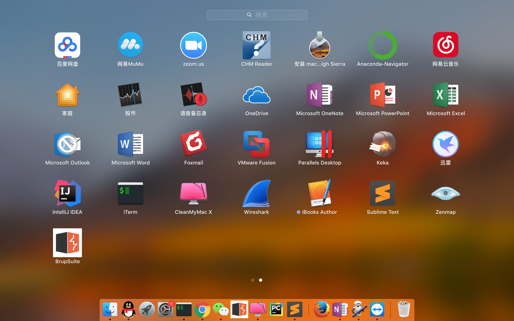

# BurpSuite.app And BurpSuite.icns

## 制作BurpSuite app 在Mac OS上 


### 0x01 Google Search burpsuite, 保存为BurpSuite.png


### 0x02 设置像素为256 x 256

```
file BurpSuite.png                               
BurpSuite.png: PNG image data, 256 x 256, 8-bit colormap, non-interlaced
```

### 0x03 设置ico 为icon_128x128@2x

```sips -z 256 256   BurpSuite.png --out icons.iconset/icon_128x128@2x.png```


```

>>>>
/Users/xxx/Desktop/BurpSuite.png
/Users/xxx/Desktop/icons.iconset/icon_128x128@2x.png
  
```

### 0x04 将icons.iconset目录下的文件转换成BurpSuite.icns

```iconutil -c icns icons.iconset -o BurpSuite.icns```



### 0x05 得到BurpSuite.icns

```
file BurpSuite.icns

BurpSuite.icns: Mac OS X icon, 15546 bytes, "ic13" type
```

### 0x06 替换burpsuite.app 的ico为BurpSuite.icns


##### 运行Shell 脚本：

###### shell 为：

`/bin/zsh`

```
cd /Users/ale/Pentester/tools/burpsuite
java -Djsse.enableSNIExtension=false -jar burpsuite.jar

```



